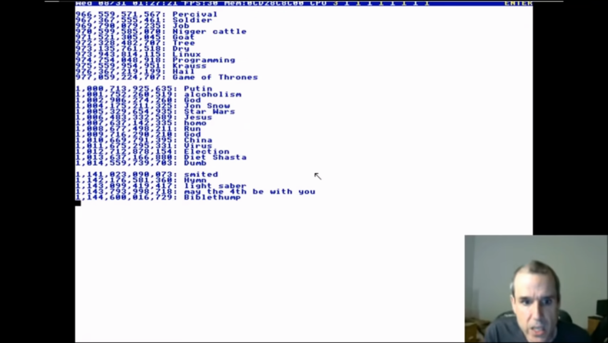

# God Words
God words based on time and question randomness

## Inspiration
Inspired by Terry Davis TempleOS "God Words" which he used to communicate with God.

## How to Use

### Compile
#### Portable
`make`

#### Installable
`make install`

### Run
If you already have a `dictionary.dict` file in your path, just run:

`gw`

If you have the file saved in another folder, just type:

`gw /path/to/dictionary`
